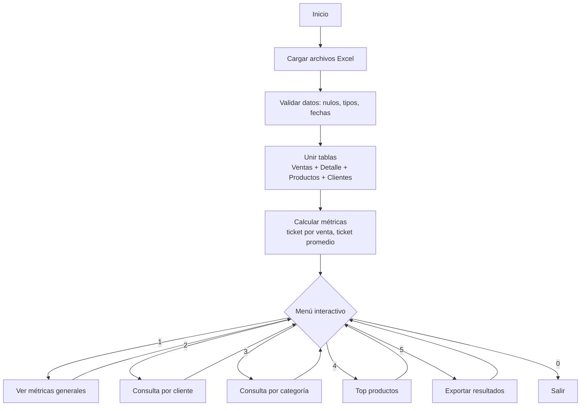

# Documentación del Proyecto

## 1. Planteamiento General

### Tema:

Análisis del comportamiento de compra de los clientes en Tienda Aurelion, con el objetivo de identificar patrones que optimicen la experiencia de compra y el valor promedio por cliente, a partir de las ventas registradas entre enero y junio de 2024, utilizando la base de datos de Clientes, Ventas, Detalle_ventas y Productos.

### Problema:

En Tienda Aurelion no se cuenta con un análisis que permita comprender los factores que determinan el valor promedio de compra.
La falta de métricas consolidadas dificulta la toma de decisiones comerciales y estratégicas, como la planificación de promociones, la definición de productos complementarios y la fidelización de clientes con mayor potencial de gasto.

### Solución:

Se propone desarrollar una herramienta analítica interactiva en Python que integre y analice los datos de Clientes, Ventas, Detalle_ventas y Productos.
El sistema permitirá identificar patrones de compra, calcular indicadores como el ticket promedio por cliente o producto, y ofrecer una visión integral del rendimiento comercial.
Con esta información, la empresa podrá diseñar estrategias más efectivas, optimizar promociones y fortalecer la relación con sus clientes clave.

## 2. Base de Datos

### Fuente:

Los datos utilizados provienen de los archivos Clientes.xlsx, Ventas.xlsx, Detalle_ventas.xlsx y Productos.xlsx, brindados por el programa Fundamentos en Inteligencia Artificial – IBM SkillsBuild & Guayerd (2025).

### Definición:

La base de datos representa la información comercial de Tienda Aurelion, integrando los registros de clientes, productos y ventas realizadas entre enero y junio de 2024.
Su propósito es centralizar los datos necesarios para analizar el ticket promedio, la frecuencia de compra y los patrones de consumo.

### Estructura:

El modelo está compuesto por cuatro tablas principales:

    -Clientes: información de identificación y ubicación de cada cliente.
    -Ventas: registro de transacciones y métodos de pago.
    -Detalle_ventas: detalle de los productos vendidos en cada operación.
    -Productos: catálogo de artículos, categorías y precios.

Las tablas se relacionan mediante claves primarias y foráneas:

    -id_cliente (Clientes → Ventas)
    -id_venta (Ventas → Detalle_ventas)
    -id_producto (Productos → Detalle_ventas)

### Tipos:

Los datos son estructurados y almacenados en formato .xlsx.
Incluyen variables numéricas, de texto y de fecha, adecuadas para su procesamiento en Python.

### Escala:

-Nominal: nombres, categorías, medios de pago.
-Intervalo: fechas de ventas y registro de clientes.
-Razón: precios, cantidades e importes.

## 3. Programa en Python

### Pasos:

1. Cargar datos: leer Clientes.xlsx, Ventas.xlsx, Detalle_ventas.xlsx, Productos.xlsx.

2. Validar: tipos (fechas/números), nulos, duplicados clave, cantidades/precios > 0, fechas dentro de enero y junio 2024.

3. Unir:

    Ventas ↔ Detalle_ventas (por id_venta)
    Ventas ↔ Clientes (por id_cliente)
    Ventas ↔ Productos (por id_producto)

4. Calcular métricas:

    -Importe línea = cantidad * precio_unitario
    -Ticket por venta = suma importes por id_venta
    -Ticket promedio por cliente y por categoría

5. Consultas interactivas (menú): Generales, por cliente, por categoría, top productos.

6. Exportar resultados filtrados (CSV/XLSX).

7. Registrar errores/advertencias (log simple).

### Pseudocódigo:

```pseint

INICIO

    ESCRIBIR "=== ANÁLISIS DE VENTAS - TIENDA AURELION ==="
    ESCRIBIR "Cargando datos..."

    // 1. CARGA DE DATOS
    LEER archivo CLIENTES.xlsx
    LEER archivo VENTAS.xlsx
    LEER archivo DETALLE_VENTAS.xlsx
    LEER archivo PRODUCTOS.xlsx

    // 2. VALIDACIONES BÁSICAS
    VALIDAR que no existan campos nulos en claves principales
    VALIDAR que las fechas estén entre ENERO y JUNIO de 2024
    VALIDAR que precios y cantidades sean mayores a 0

    // 3. UNIÓN DE TABLAS
    UNIR VENTAS con DETALLE_VENTAS por id_venta
    UNIR resultado con PRODUCTOS por id_producto
    UNIR resultado con CLIENTES por id_cliente

    // 4. CÁLCULOS PRINCIPALES
    PARA cada registro EN tabla_unida HACER
        importe_linea ← cantidad * precio_unitario
    FIN PARA

    AGRUPAR por id_venta → calcular total_venta
    AGRUPAR por id_cliente → calcular ticket_promedio_cliente
    AGRUPAR por categoria → calcular ticket_promedio_categoria

    // 5. MENÚ INTERACTIVO
    REPETIR
        ESCRIBIR "1. Ver métricas generales"
        ESCRIBIR "2. Consultar por cliente"
        ESCRIBIR "3. Consultar por categoría"
        ESCRIBIR "4. Ver top productos"
        ESCRIBIR "5. Exportar resultados"
        ESCRIBIR "0. Salir"
        LEER opcion

        SEGÚN opcion HACER
            CASO 1:
                MOSTRAR ticket_promedio_global, top_clientes, top_categorias
            CASO 2:
                LEER id_cliente
                MOSTRAR ventas y ticket del cliente
            CASO 3:
                LEER categoria
                MOSTRAR ticket promedio y productos más vendidos
            CASO 4:
                MOSTRAR productos con mayor importe_total
            CASO 5:
                EXPORTAR resultados a archivo Excel
            CASO 0:
                ESCRIBIR "Programa finalizado."
            DE OTRO MODO:
                ESCRIBIR "Opción no válida"
        FINSEGÚN
    HASTA opcion = 0

FIN

```

### Diagrama:



## 4. Sugerencias Copilot

### Aceptadas:

- Correción de ortografía y redacción.
- Detalle con precisión de la base de datos.
- División por secciones. 

### Descartadas:

- Uso de minúsculas en el pseudocodigo.
- Archivo de requisitos.txt.
- Reglas de validación de los datos.